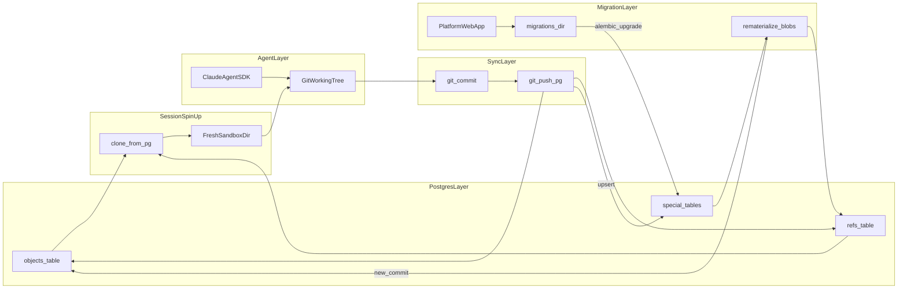
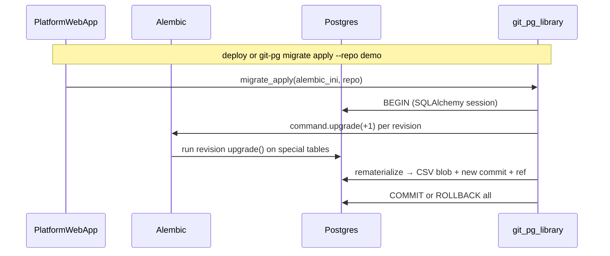
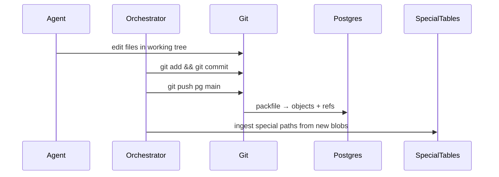
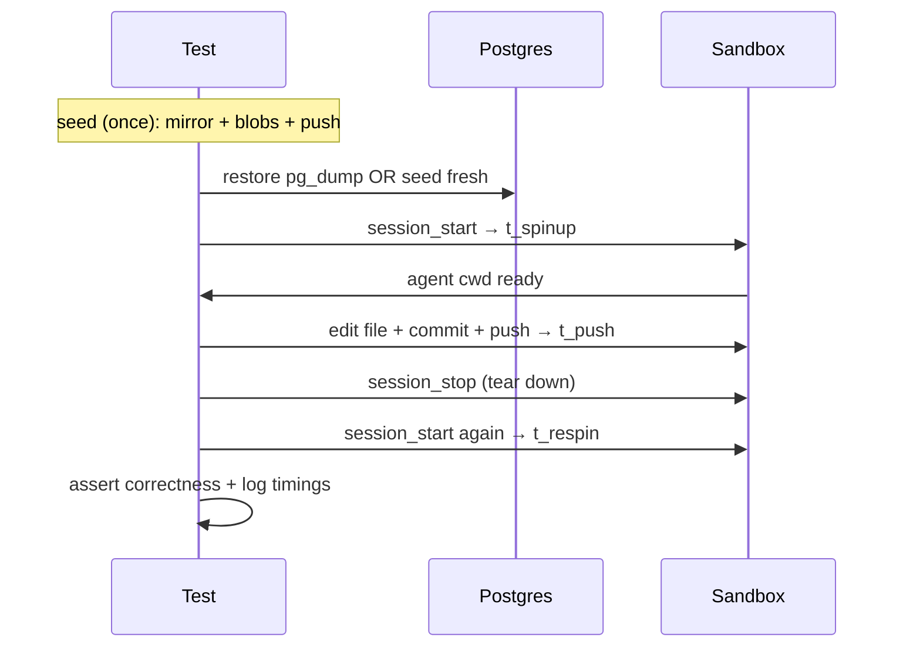

# Git-PG: Sandboxed Agent + Postgres Git Store

## Overview

Fast spin-up of sandboxed agent working trees from Postgres, sync commits back via git push, special-file tables migratable via Alembic (migrations in platform web app source, not sandbox repos), full repo reconstruction from Postgres alone.

Python via uv with strict mypy, ruff, pre-commit. SQLAlchemy 2.0 async ORM. Claude Agent SDK for agents in sandboxes.

## Locked decisions

- **Reconstruction:** Postgres alone must be enough to `git clone` a complete repo (all file bytes, including binaries).
- **Sync:** Git-native — agent edits → commit → push → Postgres.
- **Session spin-up (demo):** Straight from the database every time — clone a full working tree into a fresh sandbox, then start the agent. No warm image cache for v1.
- **Session spin-up (later):** Optional cached/incremental working-tree images for sub-second starts (out of scope for demo).
- **Special data:** Real **tables** (not read-only views over blobs). Migratable with Alembic.
- **Non-special sandbox data:** Git blobs only — **never** migrated.
- **Migrations location:** In the **platform web app source tree** (normal web app layout) — **not** inside agent sandbox git repos stored in Postgres.
- **After migration:** Rematerialize special file blobs **from the migrated tables inside the DB transaction** — no filesystem surgery.
- **File versions (product):** Append-only `file_versions` rows (UUID PK) projected when `main` advances; `file_comments` FK to those UUIDs with **no ON DELETE CASCADE**. Agents push only to `agent/<id>` branches; approve fast-forwards `main` then projects versions. Live UI updates via WebSocket (no polling).
- **Agent sandbox lifetime (intended):** Keep the sandbox (and Claude session) for a run until **approve**, **reject**, or **crash** — not tear down at first “awaiting approval”. Fan-out **agent rebase** should resume that same session (it has the change context). Demo may leave containers warm; production should **hibernate** idle sandboxes and wake them for rebase/approve work.
- **Agent sandbox lifetime (demo now):** Workspace + Claude transcript stay warm while `awaiting_approval`; each turn is a short-lived Docker container that **resumes** `claude_session_id`. Tear down on approve / reject / fail / delete.

## Two different “git” contexts (important)

| | Platform source repo | Agent sandbox repos (in Postgres) |
|---|---|---|
| **What it is** | Your monorepo: web app + `git-pg` package | Per-customer/per-session working trees agents edit |
| **Lives where** | GitHub / your normal VCS | Postgres `objects` + `refs` via gitgres |
| **Contains** | Web app code, Alembic migrations, deploy config | Data files (`data/rates.csv`), agent-edited code |
| **Migrations?** | **Yes** — `apps/platform-web/alembic/versions/` | **No** — never |

Migrations govern the **platform database schema** for special tables. They deploy with your web app like any normal project. Agent sandbox repos are **data**, not where you version platform schema changes.

### Repo layout evolution

**Now (trial — this repo):**
```
git-pg/
  src/git_pg/                 # library (becomes packages/git-pg)
  apps/demo-web/              # stand-in for platform web app
    alembic.ini
    migrations/               # Alembic migrations live HERE
    src/
  tests/
```

**Later (monorepo):**
```
customer-platform/
  packages/git-pg/            # extracted from trial
  apps/platform-web/          # customer platform web app
    alembic.ini
    alembic/versions/           # same role — platform-owned, not in sandbox repos
    src/
```

Sandbox git repos in Postgres contain only paths like `data/rates.csv` — no `migrations/` directory.

## Architecture



**Three layers in Postgres:**

| Layer | Purpose | Migrated? |
|---|---|---|
| **Git object store** | Lossless repo (`objects` + `refs`) | Only special paths get new blobs written after a migration; non-special blobs untouched |
| **Special tables** | Typed, queryable, **writable** state for designated paths | **Yes** — Alembic DDL/DML |
| **Optional views** | Convenience reads over special tables | No — views are not the migration target |

**Why tables, not views over blobs:** if special data were only a `VIEW` parsing `objects.content`, you cannot run a transactional `UPDATE … percentage → float` and then have the repo reflect it without hacking files. Special paths need a **table as the migratable source**; the git blob for that path is a **serialized export** of the table. If a design “only works as a view,” it is the wrong design for this requirement.

---

## Concrete walkthrough

**Platform source (monorepo / trial repo) — where migrations live:**
```
apps/demo-web/                          # later: apps/platform-web/
  alembic.ini
  alembic/
    versions/
      20260806120001_rates_pct_to_float.py
  src/main.py                           # deploy runs alembic upgrade + git_pg.migrate.apply()
```

**Agent sandbox repo (in Postgres) — data only, no migrations:**
```
tenant-repo/                            # cloned into sandbox on session start
  data/rates.csv                        # SPECIAL → rates table
  config.yaml                           # SPECIAL → app_config table
  src/app.py                            # non-special → blob only
  assets/logo.png                       # non-special → blob only
```

**Agent session (DB → sandbox → agent → DB):**
1. Orchestrator creates empty sandbox dir `/work/sessions/42/`.
2. **Spin-up:** `git-pg session start --repo myrepo --ref main --session 42` clones from Postgres into `/work/sessions/42/myrepo/`.
3. Claude Agent SDK runs with `cwd` set there.
4. Agent edits files → orchestrator `git add` + `git commit` + `git push pg`.
5. Push upserts `objects`/`refs`; for special paths, also upserts special tables from file content.
6. Tear down sandbox. Next session clones fresh from DB.

```bash
git-pg session start --repo myrepo --ref main
```

---

## Prior art to build on (not reinvent)

| Project | Use for | Link |
|---|---|---|
| **[gitgres](https://github.com/andrew/gitgres)** | Canonical `objects` + `refs` schema, libgit2 backend, `git-remote-gitgres` | Primary storage layer — [Andrew Nesbitt's writeup](https://nesbitt.io/2026/02/26/git-in-postgres.html) explains the 2-table model |
| **[go-gitgres](https://github.com/muandane/go-gitgres)** | Go alternative if you prefer a single binary + go-git storer | Lighter weight, same concept |
| **Claude Agent SDK (Python)** | Agent loop + sandbox | [`claude-agent-sdk`](https://github.com/anthropics/claude-agent-sdk-python), sandbox via `ClaudeAgentOptions(sandbox={"enabled": True})` |
| **Git LFS clean/smudge pattern** | Inspiration for path→handler rules | Same idea for special paths |
| **[Alembic](https://alembic.sqlalchemy.org/)** | Versioned Python/SQL migrations for SQLAlchemy | Special-table schema + data migrations |
| **pglifecycle** | YAML↔SQL round-trip patterns | Reference for serializers |

**What we are NOT doing:** treating special data as read-only views over blobs; migrating non-special git blobs; applying migrations by editing files on disk.

---

## Recommended stack

**Language: Python 3.11+** — matches Claude Agent SDK, easy YAML parsing, async orchestration.

**Python toolchain (strict from day one):**

| Tool | Role |
|---|---|
| **[uv](https://docs.astral.sh/uv/)** | Package manager, lockfile (`uv.lock`), venv, `uv run` |
| **[SQLAlchemy 2.0](https://docs.sqlalchemy.org/en/20/) (async)** | ORM — industry-standard Postgres access with `Mapped[]` typed models |
| **mypy** | Strict static typing — `strict = true`; SQLAlchemy 2.0 `Mapped` annotations |
| **ruff** | Lint + format (replaces black/isort/flake8) |
| **pre-commit** | Hooks: ruff check/format, mypy, trailing whitespace, etc. |
| **Pydantic v2** | Boundary models (CLI/config/API); not a DB layer |
| **dataclasses** | Internal domain objects where validation is not needed |

**Typing rules:**
- No bare `dict` for structured data — use `@dataclass`, `BaseModel`, or SQLAlchemy ORM models.
- `dict[K, V]` only for genuine hashmaps (e.g. `dict[str, Handler]` registries).
- DB rows: **SQLAlchemy 2.0 declarative models** with `Mapped[str]`, `Mapped[int]`, etc.
- Typed function signatures everywhere; no untyped `Any` without justification.
- `py.typed` marker in package; mypy runs over `src/` and `tests/`.

**Data layer split:**

| Layer | Tool | Location |
|---|---|---|
| **Schema migrations** | Alembic | `apps/demo-web/alembic/versions/` (platform source, not sandbox repos) |
| **Runtime DB access** | SQLAlchemy 2.0 async | `packages/git-pg` |
| **API / CLI boundaries** | Pydantic | web app + git-pg |
| **Git object I/O** | gitgres backend / libgit2 | Postgres `objects`, `refs` |

Alembic migration revisions live in the **web app subdirectory** and deploy with the platform. `git-pg` provides `migrate.apply(alembic_ini, repo_id)` which the web app calls after `alembic upgrade` to rematerialize sandbox blobs.

**Components:**
- **Postgres 16+** with gitgres extension (or vendored schema if extension install is too heavy for v1)
- **SQLAlchemy 2.0 + asyncpg** — async engine, `AsyncSession`, typed ORM models for special tables
- **Claude Agent SDK** — local runtime, sandboxed Bash + file tools
- **Orchestrator library (`git-pg`)** — session spin-up, commit/push, special-table sync, **rematerialize after platform migration**
- **Special-table registry** — pluggable handlers: parse file→table, serialize table→file
- **Alembic** — owned by the **web app** (`apps/demo-web/alembic/`); `git-pg` runs `alembic upgrade` programmatically and rematerializes in the same transaction

---

## Postgres schema (extends gitgres core)

**Core (from gitgres — do not redesign):**
```sql
-- repositories, objects(repo_id, oid, type, size, content), refs(repo_id, name, oid)
```

**Special-path registry + live typed tables** (SQLAlchemy ORM models mirror these):

```sql
CREATE TABLE special_rules (
  id          serial PRIMARY KEY,
  repo_id     int REFERENCES repositories(id),
  path        text NOT NULL,           -- e.g. 'data/rates.csv'
  handler     text NOT NULL,           -- e.g. 'csv:rates', 'yaml:app_config'
  UNIQUE (repo_id, path)
);

-- Live special table (migratable). NOT a view over blobs.
CREATE TABLE rates (
  repo_id     int NOT NULL,
  name        text NOT NULL,
  rate        text NOT NULL,           -- before migration; becomes float after
  PRIMARY KEY (repo_id, name)
);

CREATE TABLE app_config (
  repo_id     int PRIMARY KEY,
  name        text,
  port        int,
  raw         jsonb
);

-- Optional: read convenience (views over tables are fine; migrations target tables)
-- CREATE VIEW rates_v AS SELECT * FROM rates;
```

**Binary / non-special files:** stay only in `objects`. No migration surface.

**ORM models (SQLAlchemy 2.0 declarative, illustrative):**

```python
class Rate(Base):
    __tablename__ = "rates"
    repo_id: Mapped[int] = mapped_column(primary_key=True)
    name: Mapped[str] = mapped_column(primary_key=True)
    rate: Mapped[str] = mapped_column()  # text before migrate; float column after Alembic DDL
```

Ingest/rematerialize handlers use `AsyncSession` — no hand-written `INSERT`/`SELECT` in Python.

---

## Special file handling (tables + serializers)

| Path | Handler | Table | Directions |
|---|---|---|---|
| `data/rates.csv` | `csv:rates` | `rates(name, rate)` | file→table on push; table→file on migrate |
| `config.yaml` | `yaml:app_config` | `app_config(...)` | same |
| `src/**`, `assets/**` | none | — | blob only; never migrated |

Each handler implements:
- `ingest(blob_bytes) → upsert rows` (agent push path)
- `materialize(repo_id) → blob_bytes` (migration rematerialize path)

**Invariant:** for a special path, `materialize(ingest(file))` is lossless (modulo intentional formatting rules).

### Handler registry (how it's wired)

Three pieces per special path:

| Piece | Role |
|---|---|
| **`special_rules` row** | `(repo_id, path, handler)` — e.g. `data/settings.json` → `json:settings` |
| **Handler class** | Registered at startup by handler id; implements ingest + materialize |
| **Postgres table(s)** | Owned by the handler; schema migrated via Alembic in the web app |

```python
# src/git_pg/special/registry.py
class SpecialHandler(Protocol):
    handler_id: ClassVar[str]          # e.g. "json:settings"
    table_names: ClassVar[tuple[str, ...]]

    async def ingest(
        self, session: AsyncSession, repo_id: int, path: str, blob: bytes
    ) -> None: ...

    async def materialize(
        self, session: AsyncSession, repo_id: int, path: str
    ) -> bytes: ...


class HandlerRegistry:
    def register(self, handler: SpecialHandler) -> None: ...
    def get(self, handler_id: str) -> SpecialHandler: ...
    async def ingest_path(
        self, session: AsyncSession, repo_id: int, rule: SpecialRule, blob: bytes
    ) -> None: ...
    async def materialize_paths(
        self, session: AsyncSession, repo_id: int, handler_ids: set[str]
    ) -> dict[str, bytes]: ...   # path → blob bytes for rematerialize commit
```

**When rules are registered:** platform config (defaults per repo template) and/or rows in `special_rules`. Adding a new file type never changes the orchestrator — only a new handler + table + Alembic revision + rule entry.

**Push flow:** after `git push`, for each changed path in `special_rules`, load blob from new commit → `registry.ingest_path(...)`.

**Migrate flow:** after Alembic DDL/DML, for each handler touched by the migration (or all handlers for the repo), `registry.materialize_paths(...)` → write blobs into migration commit.

### Adding JSON later (concrete example)

Suppose you add `data/settings.json`:

```json
{
  "theme": "dark",
  "refresh_interval_ms": 5000,
  "features": ["search", "export"]
}
```

**1. Alembic revision** in `apps/demo-web/alembic/versions/` (platform source):

```sql
CREATE TABLE settings (
  repo_id              int PRIMARY KEY,
  theme                text NOT NULL,
  refresh_interval_ms  int NOT NULL,
  features             jsonb NOT NULL    -- or text[] if you prefer
);
```

**2. ORM model** in `src/git_pg/db/orm/settings.py`:

```python
class Settings(Base):
    __tablename__ = "settings"
    repo_id: Mapped[int] = mapped_column(primary_key=True)
    theme: Mapped[str] = mapped_column()
    refresh_interval_ms: Mapped[int] = mapped_column()
    features: Mapped[list[str]] = mapped_column(JSONB)
```

**3. Handler** in `src/git_pg/special/json_settings.py`:

```python
class SettingsDocument(BaseModel):
    theme: str
    refresh_interval_ms: int
    features: tuple[str, ...]


class JsonSettingsHandler:
    handler_id = "json:settings"
    table_names = ("settings",)

    async def ingest(self, session, repo_id, path, blob) -> None:
        doc = SettingsDocument.model_validate_json(blob)
        await session.merge(Settings(repo_id=repo_id, theme=doc.theme, ...))

    async def materialize(self, session, repo_id, path) -> bytes:
        row = await session.get(Settings, repo_id)
        doc = SettingsDocument(
            theme=row.theme,
            refresh_interval_ms=row.refresh_interval_ms,
            features=tuple(row.features),
        )
        return doc.model_dump_json(indent=2).encode() + b"\n"
```

**4. Register** in app startup:

```python
registry.register(JsonSettingsHandler())
```

**5. Rule** (config or DB):

```yaml
# config/special_rules.yaml (example)
rules:
  - path: data/settings.json
    handler: json:settings
```

**6. Future JSON migration** (same pattern as CSV): e.g. rename `refresh_interval_ms` → `poll_interval_ms` via Alembic in the web app; rematerialize writes updated `settings.json` into a migration-authored git commit.

### Handler shapes (pick per file type)

| File shape | Handler pattern | Example |
|---|---|---|
| **Tabular** (rows) | One file → many table rows | `csv:rates` |
| **Document** (single object) | One file → one table row | `yaml:app_config`, `json:settings` |
| **Document array** | One file → many rows (like CSV but JSON) | `json:items` → `items(id, payload jsonb)` |
| **Opaque binary** | No table; metadata only (v2) | `blob:metadata` → S3 pointer |

JSON fits either **document** (one row per file) or **array** (one row per element) depending on the schema you want to migrate with Alembic.

---

## Special data migrations (Alembic in platform web app)

### Goal

Transform typed special data **transactionally in Postgres**. Alembic revision files live in **`apps/demo-web/alembic/versions/`** (platform source — normal web app practice). After Alembic applies them, `git-pg` rematerializes affected sandbox git blobs from the tables so the next agent spin-up sees updated files.

### How git-pg applies Alembic (not hand-rolled SQL)

`git_pg.migrate.apply_migrations()` uses Alembic's programmatic API:

1. Opens a SQLAlchemy `AsyncSession` transaction.
2. For each pending revision: `alembic.command.upgrade(cfg, "+1")` on the **same connection** (`transaction_per_migration=False`).
3. Calls `rematerialize_repo()` to write special-path git blobs + migration-authored commit.
4. On any failure: SQLAlchemy rolls back the entire transaction (Alembic DDL + git objects + `alembic_version`).

Standalone schema-only deploy: `cd apps/demo-web && alembic upgrade head` (no git rematerialize).

Platform deploy path: `apps/demo-web/src/deploy.py` → `Orchestrator.migrate_apply()` (Alembic + rematerialize).

### Concrete example: percentage strings → floats

**Before** — sandbox repo has `data/rates.csv`; Postgres `rates` table mirrors it:

```csv
name,rate
alpha,12.5%
beta,3%
```

**Migration revision** in platform web app source (`apps/demo-web/alembic/versions/20260806120001_rates_pct_to_float.py`):

```python
def upgrade() -> None:
    op.alter_column(
        "rates",
        "rate",
        type_=sa.Float(),
        postgresql_using="replace(rate, '%', '')::double precision / 100.0",
    )
```

**Apply path (web app deploy or CLI — single Postgres transaction):**



1. Web app calls `git_pg.migrate.apply()` (or `git-pg migrate apply` CLI).
2. Each Alembic revision runs via `alembic.command.upgrade`, then `rematerialize_repo()` in the **same transaction**.
3. Rematerialize writes a **real git commit** into the sandbox repo’s object store (new blob + tree + commit + ref update), not a filesystem edit.
4. Non-special sandbox blobs unchanged (same oids in new tree).
5. On failure → full rollback: tables, `alembic_version`, **and** git refs/objects.

**Git history after upgrade → downgrade (append-only):**

```
C0  agent/seed commit            data/rates.csv = 12.5%, 3%
C1  migrate: rates_pct_to_float  data/rates.csv = 0.125, 0.03
C2  migrate: downgrade …         data/rates.csv = 12.5%, 3%
```

Downgrade does **not** `git reset` back to C0. It runs Alembic `downgrade`, rematerializes from the restored table, and appends C2. Agents that already cloned C1 keep a valid parent link; next spin-up sees C2.

**Migration-authored commit (required):**

| Field | Value |
|---|---|
| **author / committer** | Migration system identity, e.g. `git-pg migration <migration@git-pg.local>` |
| **message** | References the Alembic revision, e.g. `migrate: rates_pct_to_float (20260806120001)` |
| **tree** | Updated `data/rates.csv` (floats) + unchanged non-special paths |

After restart, `git log -1` in the sandbox shows this commit; `git show` shows the CSV diff.

**After:** next `session start` on the sandbox repo clones CSV as:

```csv
name,rate
alpha,0.125
beta,0.03
```

### Rules

| Data | Migrated? | Where it lives |
|---|---|---|
| Special tables | Yes (Alembic) | Postgres; schema defined by web app migrations |
| Sandbox git blobs (special paths) | Rematerialized from tables | Postgres `objects` — not edited on filesystem |
| Non-special sandbox blobs | No | Postgres `objects` only |
| Alembic migration revision files | Versioned in platform source | `apps/platform-web/alembic/versions/` — **not** in sandbox repos |

### Why this matches “transactionality”

- Alembic upgrade and rematerialize share one SQLAlchemy transaction (`transaction_per_migration=False`).
- Rematerialization uses the **same DB connection/transaction** as Alembic upgrade.
- Filesystem is never the migration execution surface.

### Alembic layout (platform web app — not sandbox repo)

```
apps/demo-web/                # trial; later apps/platform-web/
  alembic.ini
  migrations/
    alembic/versions/
    20260806120000_rates_pct_to_float.sql
  src/
    deploy.py                 # alembic upgrade → git_pg.migrate.rematerialize()
```

This is identical to how any web app ships database migrations. The only addition is the `git-pg` rematerialize step that syncs sandbox git blobs from the migrated tables.

---

## Agent sandbox setup

```python
from claude_agent_sdk import query, ClaudeAgentOptions

options = ClaudeAgentOptions(
    cwd="/work/sessions/42/myrepo",
    sandbox={
        "enabled": True,
        "filesystem": {
            "allowRead": ["."],
            "allowWrite": ["."],
            "denyRead": ["~/.", "../"],
        },
    },
    setting_sources=[],  # strict isolation — no inherited user settings
    permission_mode="bypassPermissions",
)
```

**Orchestrator responsibilities:**
- **`session start`:** allocate session id, create sandbox dir, clone repo+ref from Postgres, wire `cwd` + sandbox config, return ready handle
- **`session run`:** invoke Claude Agent SDK against that cwd
- **`session commit`:** `git add` + `git commit` + `git push pg` after agent turns; ingest special paths into tables
- **`session stop`:** tear down sandbox dir — on approve / reject / fail / delete (demo keeps the tree warm through `awaiting_approval` for same-agent rebase)
- **`migrate apply`:** `git-pg` runs Alembic from `apps/demo-web/alembic.ini`, then rematerializes in the same DB transaction

**Security:** combine SDK sandbox (OS-level Bash isolation) with permission deny rules for secrets (`.env`, `~/.ssh`). Sandbox applies to Bash subprocesses; Read/Edit tools need explicit permission denies too ([Claude sandboxing docs](https://code.claude.com/docs/en/sandboxing)).

### Agent sandbox lifetime & same-agent rebase

When several agents await approval and one lands on `main`, siblings must rebase. **Auto rebase** can stay mechanical (`git rebase main`). **Agent rebase** should preferably be done by the **same** agent that authored the branch: it already has the task prompt, tool history, and local working-tree intent. Spawning a cold container with a reconstructed “semantic rebase” prompt is a weaker fallback.

| Phase | Behavior |
|---|---|
| **Current demo** | After the first agent turn, the **workspace + Claude transcript** stay warm (`session_cwd`, `claude_session_id`, HOME under `agent-home/`). Containers are short-lived per turn. Fan-out **agent rebase** resumes that same Claude session in the same workspace (cold clone only if the warm tree is gone). Tear down on approve / reject / fail / delete. |
| **Production target** | Same logical lifetime, but **hibernate** idle sandboxes (pause / checkpoint) so waiting on human approve doesn’t burn CPU/API budget; wake on fan-out rebase or further user action. |

Rationale: rebase quality tracks continuity of context more than git mechanics. Cost control belongs in hibernate/wake, not in discarding the authoring session early.

---

## Sync pipeline (commit → push → special tables)



**Ingest trigger (v1):** orchestrator calls ingest after successful push (simpler than DB triggers).

---

## Session spin-up (Postgres → sandboxed filesystem)

This is the hot path for demos: **every agent session starts from the database**, not from a leftover working tree.

### Demo path (v1) — clone from DB each time

```bash
git-pg session start --repo myrepo --ref main --session 42
# Internally:
#   mkdir -p /work/sessions/42
#   git clone gitgres::dbname=gitpg/repos/myrepo /work/sessions/42/myrepo
#   git -C ... checkout main   # or --branch at clone time
#   return cwd=/work/sessions/42/myrepo
```

**Why this is enough for a demo:**
- Correct by construction (same path as reconstruction)
- No cache invalidation bugs
- Latency is “Postgres object fetch + write tree to disk” — fine for small/medium agent repos

**Make it as fast as possible without caching:**
- Prefer `git clone --branch <ref>` over clone-then-checkout
- Use a local temp filesystem (tmpfs / fast SSD) for `/work/sessions/`
- Parallelize blob writes if using Path 2 (programmatic export) for very large trees
- Keep the Postgres connection pool warm in the orchestrator process

**Path 1 — Standard git (preferred for v1):**
```bash
git clone gitgres::dbname=gitpg/repos/myrepo /dest
# Full working tree, all blobs from objects table
```

**Path 2 — Programmatic export (fallback / speed experiment):**
- SQL: walk `refs` → commit → recursive tree walk via gitgres functions
- Write files to disk from `objects.content` where `type = blob`
- Then `git init` + optional re-hydrate `.git` if the agent needs full history (or shallow: write tree only + synthetic HEAD)

For agent demos that need real `git log` / commit / push, Path 1 is the default.

### Later (out of scope for demo) — cached / incremental images

When clone-from-DB becomes the bottleneck:

| Optimization | Idea |
|---|---|
| **Warm base checkout** | Keep a read-only checkout of `main@oid` on disk; `cp -a` or hardlink-copy into session dir |
| **Content-addressed object cache** | Local `.git/objects` cache keyed by oid; clone only fetches missing oids from Postgres |
| **Overlay / CoW** | Snapshot a base tree with overlayfs / btrfs / APFS clones; session writes go to upper layer |
| **Incremental update** | On ref move, `git fetch` into a shared bare repo, then checkout into session (avoid full re-clone) |

These keep Postgres as source of truth; the cache is disposable.

**Verification gates:**
1. Seed → push → `session start` → tree matches
2. Agent edit → push → new `session start` sees edit
3. CSV migration `%` → float (see integration test below) — migration commit visible after restart
4. Failed migration rolls back tables **and** refs (no orphan migration commit)

---

## Integration test: rates CSV `%` → float

Canonical path for special-table migrations. File: `tests/integration/test_migrate_rates_csv.py`.

### Setup

1. Seed a sandbox repo in Postgres containing:
   ```
   data/rates.csv
   name,rate
   alpha,12.5%
   beta,3%
   ```
2. Register `data/rates.csv` → `csv:rates` special rule; ingest into `rates` table.
3. `session start` → assert working tree CSV still has `%` strings; note `HEAD` oid as `pre_migrate`.
4. `session stop` (tear down sandbox dir).

### Act (no sandbox, no filesystem edits of the sandbox tree)

1. Apply Alembic migration `apps/demo-web/alembic/versions/…_rates_pct_to_float.sql` against Postgres.
2. Call `git_pg.migrate.rematerialize(repo_id)` in the **same transaction**.
3. Assert rematerialize created a new commit oid ≠ `pre_migrate`.

### Assert on restart

1. `session start` again (fresh clone from Postgres).
2. `data/rates.csv` contains floats:
   ```csv
   name,rate
   alpha,0.125
   beta,0.03
   ```
3. `git log -1 --format='%an <%ae>%n%s'` shows migration-system author/email and migration message.
4. `git show HEAD -- data/rates.csv` shows the `%` → float diff.
5. `git rev-parse HEAD^` equals `pre_migrate` (linear history; migration commit is a normal parent link).
6. Postgres `rates.rate` column is `double precision` with float values.

### Downgrade (same module)

Downgrade is **append-only** — never rewrite git history / reset refs:

```
C0  initial rates          ← % strings (agent commit)
C1  migrate: rates_pct…    ← floats (upgrade rematerialize)
C2  migrate: downgrade …   ← % strings again (downgrade rematerialize)
```

1. `alembic downgrade` to baseline + rematerialize in the same transaction.
2. Fresh `session start` → CSV has `12.5%` / `3%` again.
3. `git rev-list HEAD` is `C2 → C1 → C0` (three distinct commits).
4. Column type is `text` again; `alembic_version` is baseline.

### Failure case (same test module)

Break the rematerialize step after Alembic DDL has run (injected boom handler) → assert full transaction rollback:

- `HEAD` still `pre_migrate`
- `rates.rate` still `text` with `%` values
- `alembic_version` still baseline (no half-applied revision)
- next `session start` still serves the pre-migrate CSV

---

## Project layout (greenfield)

```
git-pg/                               # trial → later packages/git-pg in monorepo
  docker-compose.yml
  pyproject.toml
  uv.lock
  .pre-commit-config.yaml
  docs/
    SPEC.md                           # this document
  src/git_pg/                         # importable library
    py.typed
    db/ ...
    migrate.py                        # Alembic upgrade + rematerialize
    ...
  apps/demo-web/                      # stand-in for platform-web; owns migrations
    alembic.ini
    migrations/
    src/deploy.py                     # alembic upgrade + git_pg.migrate.rematerialize
  tests/
    ...
    integration/
      test_migrate_rates_csv.py   # % → float; migration commit after restart
      test_benchmark.py
  fixtures/
    k8s-bench.dump
```

**Bootstrap (Phase 0):**
```bash
uv init --package git-pg
uv add claude-agent-sdk pydantic "sqlalchemy[asyncio]" asyncpg
uv add --dev mypy ruff pre-commit pytest pytest-asyncio
# pyproject.toml: [tool.mypy] strict = true; [tool.ruff] line-length = 88
pre-commit install
```

---

## Implementation phases

### Phase 0 — Python toolchain
- `uv` project scaffold with lockfile
- SQLAlchemy 2.0 async engine + typed ORM models for special tables
- Strict mypy, ruff lint/format, pre-commit hooks wired
- Pydantic models for CLI/API boundaries only

### Phase 1 — Postgres git store
- Docker Compose: Postgres 16 + gitgres extension
- Verify push/clone round-trip

### Phase 2 — Fast session spin-up (demo path)
- `git-pg session start|stop` — clone from Postgres every time
- Wire Claude Agent SDK; print spin-up latency

### Phase 3 — Agent edit → push loop
- Spin-up → edit → commit → push → second spin-up sees change

### Phase 4 — Special tables + serializers
- `special_rules` + `csv:rates` / `yaml:app_config` handlers
- Ingest on push; lossless materialize round-trip tests

### Phase 5 — Alembic migrations + rematerialize
- Migrations in `apps/demo-web/alembic/versions/` (platform source layout)
- Web app deploy: `alembic upgrade` → `git_pg.migrate.rematerialize()` in one transaction
- Rematerialize writes a git commit authored by the migration system (identity + message convention)

### Phase 6 — CI round-trips + rates CSV integration test
- `tests/integration/test_migrate_rates_csv.py`: seed `%` CSV → migrate → restart → float CSV + migration commit in `git log`
- Intentional failure asserts full rollback (tables + refs)
- CI runs `uv run ruff check`, `uv run ruff format --check`, `uv run mypy`, `uv run pytest`

### Phase 7 — Bulk seed + performance benchmarks
- `git-pg seed` command: mirror-clone public repo + inject synthetic blobs → push to Postgres
- Integration tests timing spin-up, commit/push, tear-down, re-spin-up on a large repo
- Optional pre-seeded `pg_dump` fixture for fast CI repeats

---

## Bulk repo seeding (efficient setup for tests)

Seeding a large repo into Postgres should use the **git pack protocol**, not row-by-row SQL inserts. gitgres already unpacks incoming packfiles into `objects` — one push moves thousands of objects efficiently.

### Recommended seed path

```bash
# 1. Mirror-clone a public repo (full object graph, no checkout)
git clone --mirror https://github.com/torvalds/linux.git /tmp/linux.mirror

# 2. Inject synthetic blobs (stress large-binary path even in v1 Postgres storage)
git -C /tmp/linux.mirror remote add inject /path/to/blob-injector  # or use git-pg seed helper
# git-pg seed injects: bench/blobs/10mb.bin, bench/blobs/50mb.bin (random bytes)

# 3. Single push into Postgres (packfile → objects table)
git -C /tmp/linux.mirror remote add pg gitgres::dbname=gitpg/repos/linux-bench
git -C /tmp/linux.mirror push pg --all
```

**Why mirror + push:** libgit2/gitgres receives one packfile, indexes it, bulk-inserts objects. This is the same efficient path production uses.

### Faster options for repeated CI runs

| Method | When to use | Speed |
|---|---|---|
| **Mirror + push** | First-time seed, fidelity test | Minutes for large repos |
| **Pre-seeded `pg_dump` restore** | CI benchmark runs (skip re-cloning GitHub) | Seconds |
| **Shallow mirror `--depth 1`** | Smaller benchmark surface, still "big" | Faster seed |
| **`git fast-import`** | Synthetic-only fixtures (no public clone) | Fastest for fake repos |

For benchmarks we use **one canonical repo** with two tiers:
- **CI default:** shallow clone of a large repo (e.g. `kubernetes/kubernetes` depth=1) + injected 10MB + 50MB blobs — runs in reasonable CI time
- **Local/manual:** full mirror of same repo or `linux` for worst-case numbers

`git-pg seed` wraps this:

```bash
git-pg seed \
  --url https://github.com/kubernetes/kubernetes \
  --repo k8s-bench \
  --depth 1 \
  --blobs 10mb,50mb \
  --pg-dump fixtures/k8s-bench.dump   # optional: save for CI restore
```

---

## Performance integration tests

Marked `@pytest.mark.integration` + `@pytest.mark.benchmark` (skipped in default CI unless `BENCHMARK=1` or nightly).

### Test flow (timed)



**Metrics recorded (stdout + optional JSON report):**

| Metric | What it measures |
|---|---|
| `seed_push_s` | Mirror clone + blob inject + first push to Postgres |
| `spin_up_ms` | `session start`: PG clone → sandbox ready |
| `commit_push_ms` | Small edit + commit + push back to PG |
| `teardown_ms` | `session stop`: delete sandbox dir |
| `re_spin_up_ms` | Second cold `session start` after push |
| `total_objects` | Row count in `objects` for repo |
| `total_blob_bytes` | Sum of blob sizes (includes synthetic 10MB/50MB) |

**Correctness assertions (not just timing):**
- Re-spin-up tree matches post-push commit (`git diff` empty)
- Synthetic blobs byte-identical after round-trip
- Special-table ingest still works on a small CSV committed atop the big repo

### Synthetic blobs (not blind to large-binary path)

Even with Postgres-only storage in v1, benchmarks **must include large binaries** so we measure blob clone/push throughput — the same path that would later offload to S3:

```
bench/blobs/
  10mb.bin    # random bytes, tracked in git
  50mb.bin    # random bytes, tracked in git
```

These inflate `objects.content` size and stress spin-up clone. When S3 offload lands (v2), the same test adds a `--storage s3` variant comparing pointer-file + fetch latency vs inline blob.

### CI strategy

```yaml
# Default PR CI: unit tests + small round-trip only
# Nightly / manual: BENCHMARK=1 BENCHMARK_PRESET=hello pytest tests/integration/test_benchmark.py -v
```

Nightly job restores `fixtures/k8s-bench.dump` (pre-seeded) → runs benchmark → uploads timing JSON artifact. Local dev can re-seed with `git-pg seed` when the fixture is stale.

---

## Known trade-offs

| Topic | Trade-off |
|---|---|
| **Spin-up latency (v1)** | Full clone each session — benchmark suite quantifies this for shallow + blob-heavy repos |
| **Large repo seed time** | First push of a big mirror is slow; CI uses pre-seeded `pg_dump` to skip re-cloning GitHub |
| **Blob storage (v1 vs v2 S3)** | Benchmarks inject 10MB/50MB blobs now to stress inline Postgres blobs; same tests extend for S3 pointers later |
| **Special vs non-special truth** | Non-special: git blobs only. Special: **tables** are migratable source; blobs for those paths are serialized exports rematerialized after migrate (and ingested on agent push) |
| **Alembic + rematerialize txn** | Must wrap Alembic upgrade and git object writes in one Postgres transaction — may need a thin `git-pg migrate` wrapper rather than raw `alembic` alone |
| **Storage size** | Full blobs per version in Postgres (no packfile deltas) |
| **gitgres maturity** | POC-grade; pin version + round-trip tests |

---

## Out of scope for v1

- Cached / CoW / overlay session images
- S3-backed blob storage
- Multi-tenant auth / RLS
- Real-time filesystem watch sync
- Migrating non-special blob content
- git merge/diff/blame in SQL
