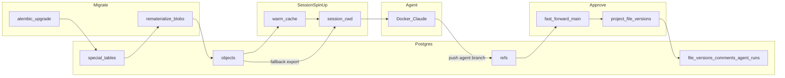

# Git-PG: Sandboxed Agent + Postgres Git Store

## Overview

Postgres is the source of truth for git repositories used by sandboxed Claude agents. Agents get a real working tree (clone/export from Postgres), edit via git, and push back. Designated **special paths** project into migratable SQL tables (Alembic in the platform app). A product layer adds durable UUID `file_versions` / `file_comments` and an **approve gate** so agents never write `main` directly.

**Stack:** Python ≥3.12, uv, strict mypy + ruff, SQLAlchemy 2.0 async, Pydantic settings (`GIT_PG_` prefix). Demo: FastAPI + React (Rsbuild / TanStack Query). Agents: Docker image wrapping the Claude Agent SDK.

## Locked decisions

- **Reconstruction:** Postgres alone must be enough to materialize a complete repo (all file bytes, including binaries).
- **Sync:** Git-native — agent edits → commit → push → Postgres (`objects` + `refs`).
- **Session spin-up:** Prefer **warm cache** (shared bare checkout per repo) then local clone into the session dir; fall back to programmatic export from `objects`. Cache is disposable; Postgres remains truth.
- **Special data:** Real **tables** (not views over blobs). Migratable with Alembic in the **platform web app**, never inside sandbox repos.
- **After migration:** Rematerialize special-path blobs **from tables inside the same DB transaction** as Alembic — no filesystem surgery of sandbox trees.
- **File versions (product):** Append-only `file_versions` (UUID PK) projected when `main` advances; `file_comments` FK those UUIDs with **no ON DELETE CASCADE**.
- **Agents:** Push only to `agent/<uuid>` branches (`allow_main=False`). **Approve** fast-forwards `main` then projects versions. Live UI via WebSocket (no polling).
- **Sandbox lifetime:** Keep workspace + Claude transcript warm while `awaiting_approval`. Short-lived containers per turn **resume** `claude_session_id`. Tear down on approve / reject / fail / delete. Production target: hibernate idle sandboxes instead of discarding context.

## Two git contexts

| | Platform source repo | Agent sandbox repos (in Postgres) |
|---|---|---|
| **What** | This monorepo: `git-pg` + demo web app | Per-repo working trees agents edit |
| **Where** | GitHub / normal VCS | Postgres `objects` + `refs` |
| **Contains** | Library, Alembic, API/UI, agent image | Data files, agent-edited code |
| **Migrations?** | **Yes** — `apps/demo-web/alembic/versions/` | **No** |

```
git-pg/
  src/git_pg/                 # library
  apps/demo-web/
    alembic.ini
    alembic/versions/         # platform schema + rematerialize-aware revisions
    api/                      # FastAPI demo
    web/                      # React demo
  docker/agent/               # Claude-in-Docker image
  tests/
```

## Architecture



**Layers in Postgres:**

| Layer | Purpose | Migrated? |
|---|---|---|
| Git object store | Lossless repo (`objects` + `refs`) | Special paths rewritten after migrate; others untouched |
| Special tables | Typed state for designated paths (`rates`, `app_config`) | Yes — Alembic |
| Product tables | `file_versions`, `file_comments`, `agent_runs` | Yes — Alembic DDL |

Implementation uses a **vendored gitgres-compatible schema** + `PostgresGitStore` (no Postgres extension required).

---

## Special file handling

| Path | Handler | Table |
|---|---|---|
| `data/rates.csv` | `csv:rates` | `rates(repo_id, name, rate)` |
| `config.yaml` | `yaml:app_config` | `app_config(repo_id, …, raw jsonb)` |
| everything else | — | blob only |

Handlers implement `ingest` (push) and `materialize` (migrate rematerialize). Invariant: `materialize(ingest(file))` is lossless modulo formatting.

**Push:** after ingesting objects/refs, for each changed `special_rules` path → `registry.ingest_path`.
**Migrate:** Alembic DDL/DML → `rematerialize_repo` writes a **migration-authored git commit** (append-only; downgrade also appends, never `git reset`).

Concrete rates example (`%` strings → floats): see `tests/integration/test_migrate_rates_csv.py` and revision `20260806120001_rates_pct_to_float.py`. Handler adapts to column type at runtime after migrate.

---

## Session spin-up and warm cache

```bash
uv run git-pg session start --repo demo --ref main
```

1. Allocate session id under `GIT_PG_SESSIONS_ROOT`.
2. If warm cache enabled (default): `ensure_current` / refresh shared bare repo under `GIT_PG_WARM_CACHE_ROOT`, then `git clone --local` into the session cwd.
3. Else / on failure: export tree from Postgres into the cwd.
4. Agent (or CLI) works in that cwd; `session push` packs back into Postgres.

**Warm-cache concurrency:** refresh is serialized with an `asyncio.Lock` per repo; cross-process `flock` is acquired only in a worker thread so concurrent session starts cannot freeze the event loop.

**Later (optional):** CoW/overlay session images, hibernate/wake for idle agent sandboxes. Not required for the demo.

---

## Product: file versions, comments, agents

### file_versions / file_comments

- When `main` advances (seed, approve FF, migrate rematerialize), project a new UUID row per path whose blob oid changed.
- Comments pin to a version UUID. Deleting versions is not part of the normal flow; FK has **no ON DELETE CASCADE**.

### agent_runs

Statuses: `running` → `awaiting_approval` → (`auto_rebasing` | `agent_rebasing`)* → `approved` | `failed` | `rejected`.

| Field | Role |
|---|---|
| `branch` | `agent/<uuid hex>` |
| `base_commit` / `head_commit` | FF gate + rebase base |
| `session_cwd` | Warm workspace path |
| `claude_session_id` | Resume token for same-agent rebase |
| `prompt` / `summary` | Task text + progress |

**Async spawn:** `POST /api/agents` enqueues a `running` row immediately; background work generates a task (optional Haiku), starts a session, runs Docker, pushes the agent branch, then `awaiting_approval`. Progress via `agent.updated` WebSocket events.

**Approve:** FF-only. `base_commit` must equal current `main`; head must be a descendant. Then project versions, tear down sandbox, fan-out rebase siblings.

**Fan-out rebase** (strategy `auto` | `agent`, chosen at approve / stored preference):

- Siblings already `awaiting_approval` → rebase immediately.
- Siblings still `running` → remember strategy in `_pending_rebase` (process-local); when they finish, auto-rebase if `main` moved.
- **Auto:** mechanical `git rebase main` in the warm tree (cold clone fallback).
- **Agent:** short-lived container resumes `claude_session_id` in the same workspace with a reconcile prompt.
- Manual `POST /api/agents/{id}/rebase` when UI shows `base_stale`.

**Reject / delete:** tear down container + workspace; delete also drops the agent ref. Approved runs cannot be deleted.

### Demo API (summary)

| Method | Route |
|---|---|
| GET | `/api/tree`, `/api/files/{path}/versions`, `/api/file-versions/{id}/content\|comments` |
| POST | `/api/file-versions/{id}/comments` |
| GET/POST | `/api/agents`, `/api/agents/{id}/approve\|reject\|rebase` |
| GET | `/api/agents/{id}/diff`, `/api/agents/{id}/commits` |
| DELETE | `/api/agents/{id}` |
| WS | `/api/ws` → `agent.updated`, `main.updated`, `file_versions.created`, `comment.created` |

### Docker agent

- Image: `git-pg-agent:local` (`docker/agent/`). Container **is** the sandbox (`ClaudeAgentOptions.sandbox.enabled=False`); host mounts workspace + persistent `agent-home/` as `HOME`.
- Env: `GIT_PG_AGENT_PROMPT`, optional `GIT_PG_CLAUDE_RESUME`; prints `GIT_PG_CLAUDE_SESSION_ID=…` for the host to store.
- Commits leftover dirty files; **does not push** (host pushes to the agent branch).

---

## Ops defaults

| Item | Value |
|---|---|
| Postgres | `localhost:54329` → container 5432 |
| Demo API (local README) | `127.0.0.1:8001` |
| Demo UI | `http://localhost:3010` (proxies `/api` → `DEMO_API_URL`, default `8001`) |
| Compose `api` service | port `8000` (optional full compose) |
| Env | `.env` from `.env.example` (`ANTHROPIC_API_KEY`, optional `GIT_PG_*`) |

---

## CLI

```bash
uv run git-pg session start|stop|push …
uv run git-pg migrate apply|downgrade --repo …
uv run git-pg seed --url … --repo … [--depth] [--blobs]
uv run git-pg benchmark [--preset hello|flask|…]
```

Benchmarks: `@pytest.mark.benchmark`, enable with `BENCHMARK=1`. Warm vs cold spin-up is measured; large presets exist for local/nightly use.

---

## Verification gates

1. Seed → push → `session start` → tree matches.
2. Agent edit → push → new session sees edit.
3. Rates `%` → float migrate → restart sees floats + migration commit; failure rolls back tables **and** refs.
4. Approve FF → `file_versions` grow; comments remain on old UUIDs when the same path is rewritten.
5. Concurrent session starts do not hang the API (warm-cache lock must not block the event loop).

---

## Known trade-offs

| Topic | Trade-off |
|---|---|
| Blob storage | Full blobs per version in Postgres (no packfile deltas) |
| Warm cache | Faster starts; must refresh after push/approve/migrate; flock must stay off the event loop |
| `_pending_rebase` | In-memory only — lost if the API process restarts mid-run |
| Agent cost while waiting | Demo keeps workspace warm; production should hibernate |
| Special vs non-special | Non-special: blobs only. Special: tables are migratable source; blobs are serialized exports |

## Out of scope (still)

- Multi-tenant auth / RLS
- S3-backed blob storage
- Real-time filesystem watch sync
- Migrating non-special blob content
- git merge/diff/blame in SQL
- Durable cross-process pending-rebase queue
